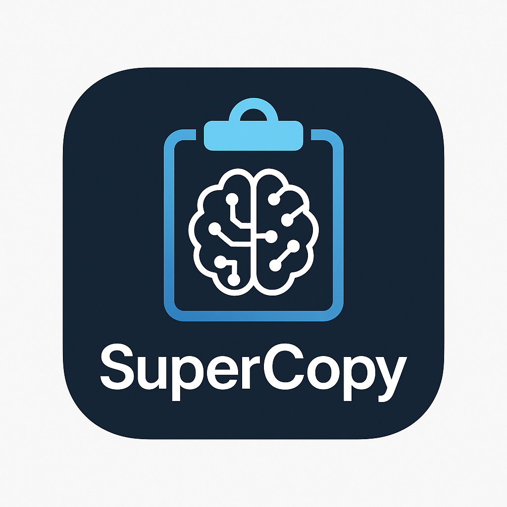
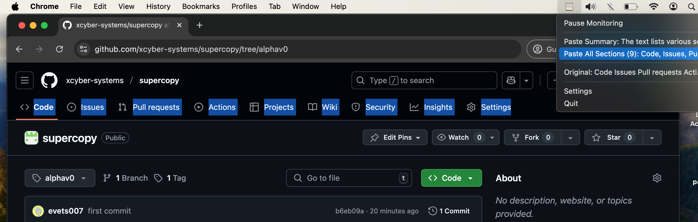
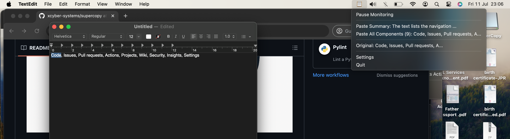

# SuperCopy: The AI-Powered Copy & Paste Assistant



SuperCopy is a smart, context-aware clipboard assistant designed for both macOS and Windows, powered by Google's Gemini API. It runs discreetly in your menu bar or system tray, automatically analyzing the text you copy and providing you with instant, useful actions.

## Features

-   **Cross-Platform**: Native support for both macOS (menu bar) and Windows (system tray).
-   **Powered by Gemini**: Uses the Gemini API for powerful and nuanced text analysis.
-   **Context-Aware Actions**: Instantly get options to paste a summary, extracted emails, or phone numbers.
-   **Privacy-Focused**: Includes a basic **secrets detector** that blocks LLM analysis for single-string text (like passwords or API keys) to protect your sensitive data.
-   **Seamless Integration**: Runs quietly in the background, enhancing your native copy-paste workflow.
-   **Easy Configuration**: A simple, secure settings dialog to configure your API key.
-   **Pause/Resume**: Easily toggle clipboard monitoring on and off.

## How It Works

1.  **Copy Text**: Copy any piece of text to your clipboard.
2.  **Secret Detection**: The app first checks if the text is a potential secret. If so, the analysis is skipped.
3.  **AI Analysis**: If the text is not a secret, SuperCopy sends it to the Gemini API for analysis.
4.  **Dynamic Menu**: Click the SuperCopy icon to see a dynamic list of actions based on the analyzed text.
5.  **Paste**: Select an action, and the transformed text (e.g., a summary) is instantly copied to your clipboard, ready to be pasted.

## Demo

Here is SuperCopy in action.

**1. Copying text from a source (e.g., GitHub):**



**2. Pasting the organized result into a text editor:**



## Installation

For the easiest setup, download the pre-built application for your operating system from the **Releases** page of this repository.

The instructions below are for **local development only**.

### Local Development Setup

#### 1. Get a Gemini API Key

SuperCopy requires a Gemini API key to function.

1.  Go to [Google AI Studio](https://makersuite.google.com/app/apikey).
2.  Click **"Create API key in new project"**.
3.  Copy the generated API key. You will need it when you first run the application.

#### 2. Clone the Repository & Install Dependencies

**macOS:**
```bash
# Navigate to the macOS directory
cd macos

# Create and activate a virtual environment
python3 -m venv venv
source venv/bin/activate

# Install dependencies
pip install -r requirements.txt

# Run for development
python3 app.py
```

**Windows:**
```bash
# Navigate to the Windows directory
cd windows

# Create and activate a virtual environment
python -m venv venv
venv\Scripts\activate

# Install dependencies
pip install -r requirements.txt

# Run for development
python main.py
```

### API Key Configuration

When you first run the application locally, it will prompt you to enter your Gemini API key. This key is stored securely in a local configuration file (`~/.supercopy_config.json`) on your machine and is never shared.

## Future Plans

We are continuously working to improve SuperCopy. Here are some features on our roadmap:

-   **Predicted 'Actions'**: In addition to predicted 'paste values', the app will suggest actions to take based on the copied text, such as creating a calendar event or sending an email.
-   **Improved Secrets Detection**: Enhance the secrets detection mechanism to more accurately identify and protect sensitive information.
-   **Support for Local LLMs**: Run analysis entirely on-device for enhanced privacy and offline capability.
-   **Multi-Provider Support**: Add support for other AI providers.

## Contributions

Contributions are welcome! If you have ideas for new features, bug fixes, or improvements, please feel free to open an issue or submit a pull request.

## License

This project is for educational and development purposes.
